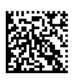

# F# WeblinkEndpoint for Zebra Printers 

Demo app to demonstrate how to leverage Weblink technology to support multiple use-cases:

*  printing price labels (repricing) using ZQ320 indoor version (label printer with Wifi and BT) + CS4070 BT scanner
*  convertion of a 300 dpi label into a 200 dpi label – this is a real case from a recent customer request. For the customer modifying the printing app was just impossible.
*  self-service label printing in parcel shops to - for instance - return goods purchased online

Tested with ZQ310 (2inch) and ZQ320 (3 inch) indoor + CS4070, ZD420 203dpi Cartridge and ZT410 203 dpi

## Getting Started

Simple instructions follow


### Demo session setup

You will need to hook up your printer to the Internet
In order to do that, you may use "Configure Printer Connectivity" in Zebra Setup Utility. 
I typically use Wifi printers and connect to ZGuest wireless network in Zebra office.

You then specify the address of the weblink endpoint by issuing 

```
! U1 setvar "weblink.ip.conn1.location" "https://weblinkendpoint.mastracu.it/websocketWithSubprotocol"
```
You then re-start / power-cycle the printer by issuing

```
! U1 setvar "device.reset" ""
```

Check the printer is now connected.
If it is, it will be listed in http://weblinkendpoint.mastracyu.it/appselector.html

The printers will also spit out a welcome label once it’s connected.

You may also need to calibrate the printer and/or reset the sensor settings depending on the media being used.

### Notes for mobile printers

On mobile printers like ZQ320 and ZQ310, I have seen a behaviour where the printer will not stay in sleep mode (https://www.zebra.com/content/dam/zebra/software/en/application-notes/AppNote-SleepMode-v5.pdf) if weblink is enabled.
The printer will awake seconds after entering sleep mode.
Because of this, I turn sleep mode off by issuing
```
! U1 setvar "power.sleep.enable" "off"
```
Also testing with ZQ310, I have noted mobile printer will shut down weblink connection after issuing battery low alert.
In my test battery low alert was issued at about 10% battery level (6.5 Volts) and printer did shut down at about 6% battery level (6.28 Volts)


### Sending JSON configuration commands to the printer

Demonstrate how one can remotely send configuration commands to a printer or query printer data by sending commands from appselector page and checking response on logtable.

Some revealing commands to issue are
```
{}{"ribbon.cartridge":null} 
```
on a ZD420 cartridge TT printer and
```
{}{"power":null} 
```
on a mobile printer.


### Repricing application

Minimum label width: 5cms or 2 inches
Minimum label height: 3cms

Follow the following steps to set it up

1. Ensure the BT scanner is configured to CR-LF terminate the barcode. 
        
2. Verify the printer is listed as connected in the the WebLinkEndPoint. Send the following json command to get the btaddress of the printer: 
```
{}{"bluetooth.short_address":null} 
```  
3. From 123scan generate the Bluetooth Pairing barcode (Serial Port Profile - Master) by keying in the address retrieved in previous point.
4. Scan the barcode with CS4070 and the scanner should establish the BT connection with the printer (solid blue LED on the printer) 

On http://weblinkendpoint.mastracu.it/pricetag.html you add a new item that you have handy in the meeting room.

**Please ensure barcode is 13-digits long as only EAN-13 barcodes are currently supported.**

Please note that scanning the BT addr barcode on the back of the printer will not work.
 
I can then go ahead and scan the barcodes of the item above. 
A pricetag will be automatically printed if the barcode is found. 
I can then change the price of the item in the table on http://weblinkendpoint.mastracu.it/pricetag.html . I then scan the same product again and the label is printed with a different price. By selecting a product and a printer from http://weblinkendpoint.mastracu.it/pricetag.html I can also show how to print a label “remotely”.

**Please note - data are not persistent and application is restarted every 24 hours so price changes / new products will be lost the following day.**

See https://devcenter.heroku.com/articles/dynos#restarting and https://devcenter.heroku.com/articles/dynos#ephemeral-filesystem

### Label conversion

For the label conversion demo, from http://weblinkendpoint.mastracu.it/appselector.html
I change the application associated with any 200dpi printer to ifadlabelconvertion. 
Now everything I send to the printer via USB gets forwarded onto the cloud.

Send file IFAAM004_2289143IFAAM004.txt via USB and it gets converted to a quasi-equivalent 200 dpi label.

Minimum label width: 5cms 
Minimum label height: 3cms

## Versioning


## Authors


## License


## Acknowledgments

